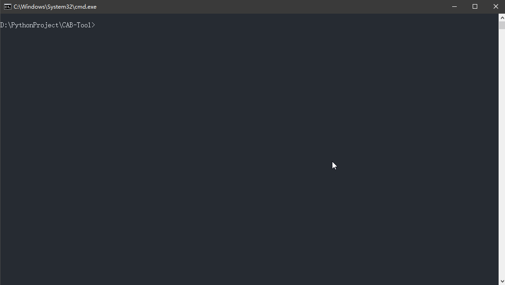

<h1 align="center"><a href="https://github.com/SnailMann" target="_blank">CAB Tool</a></h1>

> `CAB Tool`是一款针对CSDN进行博客备份的小工具
> 
> 可以将用户在CSDN博客中的markdown文章(含图片)批量备份到本地，备份可以有html及markdown版本

<p align="center">
<a href="#"></a>
<a href="https://github.com/SnailMann/CAB-Tool/releases"></a>
<a href="https://github.com/SnailMann/CAB-Tool/commits"></a>

</p>


## 介绍

`CAB Tool`  就是**csdn-article-backp-tool**，只是我有点懒,不想打这么长,还能顺便装的**一手好逼** (狗头)

> - 19/8/27因发现最近CSDN Web端登录机制的改变，目前登录模块已失效，导出出现"页面过期"。原因是CSDN引入了阿里的反爬机制，目前笔者暂无力解决，有需求的小伙伴可以帮忙挑战，提交requests
> - 笔者这里提供"临时解决方案"，可能不适合小白用户。因为失效的登录模块主要作用就为了拿到用户名和Cookies,所以临时代替方案就是在浏览器上copy自己的cookies下来。在`main_cookies.py`类的代码里，修正填写`GLOBAL_CONFIG`配置设置中的用户名和Cookies部分，然后运行其即可

**功能：**

- 支持批量备份markdown语法写的csdn博客
- 支持备份博客图片(兼容markdown语法,html语法)
- 支持两种使用方式，便于没有python基础的同学使用

**注意：**

- 目前不支持备份私密文章，只能备份自己的公开文章
- 需要登录账户密码(`markdown编辑器的爬取需要cookies`)
- `CAB Tool` 直接爬取的是csdn markdown编辑器的文本，备份的文本与编辑器上无异
- 博客说明:[求人不如求己，自己动手写一个CSDN博客备份小工具？](https://blog.csdn.net/SnailMann/article/details/96474068)


<br/>


## 引文

因为本撸发现在CSDN写的笔记好像也堆积了八九十篇啦。曾经没有数据备份意识的我本来想着从GayHub找找现成的Tool, 也不知道为什么GayHub上的不是过时了，就是效果不佳。可能大牛们嫌太简单，懒得放出来。于是，只能求人不如求己，没有玩过python的我，风风火火，简单地学习了下语法和爬虫就上马了。所以有Bug是正常嘛，见怪勿怪喔！

<br/>


## 使用
> **注意事项**
>- 经[@qqxx6661](https://github.com/qqxx6661)提醒，考虑到需要登录，如果你觉得爬虫速度过快，可能造成账号锁定，请在方式二上的配置文件上修改`sleep-time`爬虫间隔时间，默认每隔1s爬取一篇文章。另为了避免加重小白版本的使用复杂度，小白式exe启动并不支持自定义爬虫时间间隔，爬取间隔固定是1s
>- 经自身测试，间隔1s的模式下爬取90+文章，并没有问题，如果你需要爬取几百或上千的文章，未经测试，保险起见，你可以适当加大时间间隔，避免被CSDN误判


### 方式一[失效]
如果你是没有任何python基础的同学，或是懒得安装py环境。没有关系，这里也是支持小白式运行的

- 点击[cab-tool releases](https://github.com/SnailMann/CAB-Tool/releases)，下载`cabtool.exe`的最新版本
- 双击运行`cabtool.exe`就好啦


### 方式二[失效]



**第一步**

- 把项目克隆本地`git clone git@github.com:SnailMann/CAB-Tool.git`
- 确保本地有python3的环境, 并且可以使用pip安装依赖
- 进入项目目录,命令行输入`pip install -r requirements.txt`，使用pip安装py项目的必要依赖

**第二步**

- 打开`setting.yaml`配置文件
- 按照yaml规范填写CSDN的账号密码
- 按照yaml规范在download-path填写本地导出地址,不填默认为`D:\csdn-blog-backup`
- 按照yaml规范在download-img填写是否开启图片备份 `True` 或 `False`
- 按照yaml规范在sleep-time填写备份文章的时间间隔，单位是s，默认是1s。若非有需要，不建议改动

**第三步**

- 确认配置无误后
- 项目路径打开命令行，输入`py main.py`

### 方式三[有效]

**第一步**

- 把项目克隆本地`git clone git@github.com:SnailMann/CAB-Tool.git`
- 确保本地有python3的环境, 并且可以使用pip安装依赖
- 进入项目目录,命令行输入`pip install -r requirements.txt`，使用pip安装py项目的必要依赖

**第二步**

- 打开`main_cookies.py`启动文件
- 修改并填充`main_cookies.py`文件中的配置信息, 比如name , cookies等信息
- `name` 就是https://blog.csdn.net/yourname的yourname, 比如笔者的就是`SnailMann`
- `cookies` 就是在浏览器登录csdn后，通过开发者工具找一个request有cookie选项的csdn域名的链接，然后把cookie选项的整串value拷贝下来即可（可能会比较长，但没关系）

```python
GLO_CONFIG = {
    'download_path': r"D:\csdn-blog-backup",  # Default path
    'download_img': False,  # Default not to download pictures
    'sleep_time': 1,
    'name': 'yourname',  # https://blog.csdn.net/yourname <- yourname
    'cookies': 'yourcookies'
}
```
- 确定配置无误后，在命令行上运行`python main_cookies.py`即可

## 问题

- 笔者自己的测试中，自己90+的文章，图片都是能安全备份下来的的，如果有几百或上千篇，理论上也是ok的，但未经过测试
- 有问题请提issue或者email, 同时欢迎fork和pull requests参与，非常感谢！

## 博客


- Gmail : `snailmann.me@gmail.com`
- WeChat: `go_snailmann`


**本撸的博客是[https://blog.csdn.net/SnailMann](https://blog.csdn.net/SnailMann)，如果对你有帮助，记得关个注，点个赞哟？！**

